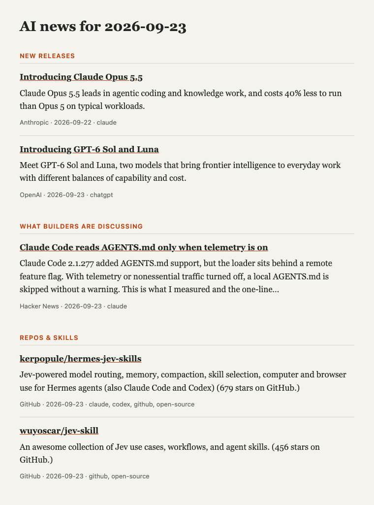
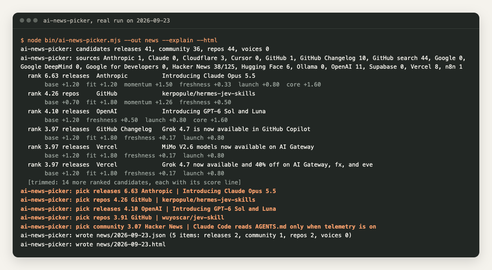
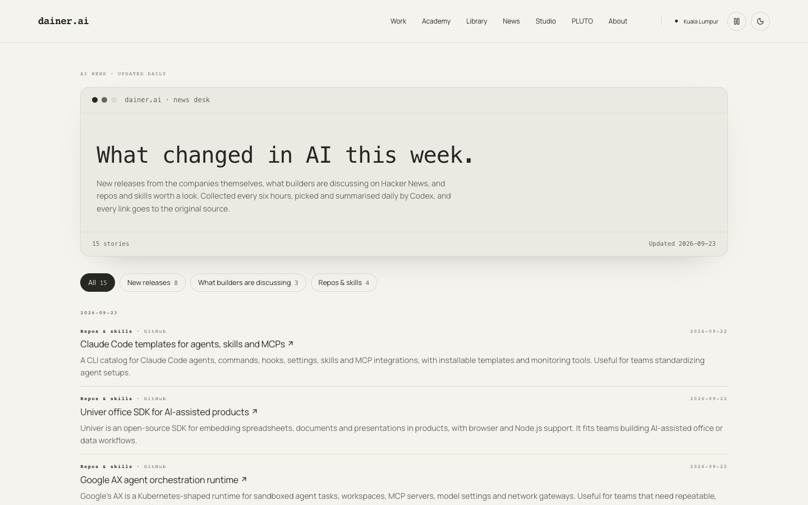
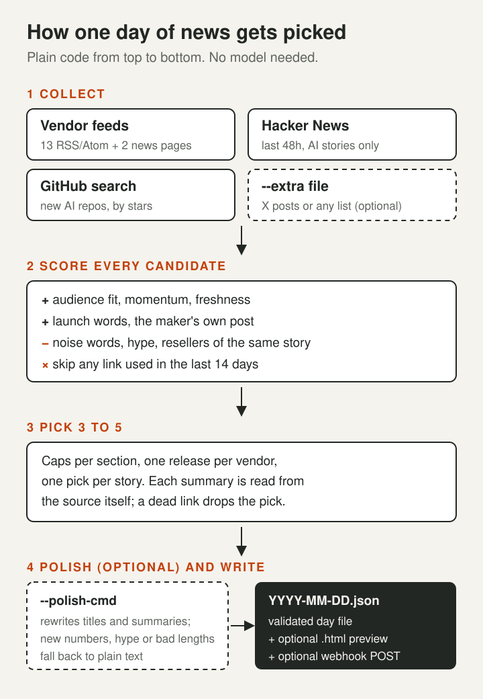

<div align="center">

# ai-news-picker

**Pick 3 to 5 useful AI news items a day with plain code. No model, no API key.**

[](LICENSE)
[](package.json)
[](#optional-polish-step)
[](examples/sample-output.json)

Built for the news page on [dainer-ai.biz](https://dainer-ai.biz/news).



</div>

Most AI news feeds give you fifty links and let you sort it out. This one keeps a short list. Every day it collects candidates from vendor blogs, Hacker News and GitHub, scores them with plain rules you can read, and writes the best 3 to 5 into one JSON file. Every link goes to the original source.

You can run it on your laptop, in a GitHub Action, or inside your own site's build. It has zero dependencies. It needs Node 20 or newer and uses nothing beyond Node 20 (built-in `fetch` and `node:test`); the tests were run on Node 22 and 24.

## Quick start

```bash
npx --yes github:Rebelzxr/ai-news-picker --explain --html
```

That writes `news/YYYY-MM-DD.json` and a small preview page next to it. The `--explain` flag prints the top 20 scores and what made each one.

Or clone it:

```bash
git clone https://github.com/Rebelzxr/ai-news-picker && cd ai-news-picker
npm test
node bin/ai-news-picker.mjs --dry-run --explain
```

First thing to try: run with `--dry-run --explain`, read why each item scored what it did, then change a word list in `config.json` and run it again.

## What it can do

- **Collect without keys.** 13 official vendor feeds, the Anthropic and Claude news pages, Hacker News and GitHub search.
- **Score with rules you can read.** Audience fit, momentum, freshness, launch words, noise and hype penalties.
- **Pick the maker, not the reseller.** "Introducing Claude Opus 5.5" beats "Opus 5.5 now on some gateway", and one story gets one slot.
- **Never repeat.** Any link used in the last 14 day files is skipped.
- **Use the source's own words.** Each summary comes from the page's feed, meta description or GitHub description. A dead link drops the pick (except a release page that blocks bots with 401/403, since its feed already proved it exists).
- **Polish if you want.** Pass any command (a model CLI, a script) to rewrite titles and summaries. Rewrites with new numbers, hype or bad lengths fall back to plain text.
- **Take your own finds.** `--extra` adds X posts, newsletter links or anything else in a simple JSON shape.
- **Ship the result anywhere.** A validated day file, an optional HTML preview and an optional webhook POST.

## Demo gallery

<table>
<tr>
<td width="50%"><br><b>See why each item ranked.</b><br>Real <code>--explain</code> output from a run on 23 Sep 2026. Each score is split into its parts; the last 14 of the top 20 ranked lines are trimmed and marked.</td>
<td width="50%"><a href="examples/sample-output.json"><b>examples/sample-output.json</b></a><br><b>The actual day file.</b><br>Five picks from the same real run: two releases, two repos, one Hacker News story. The hero image above is its <code>--html</code> preview.</td>
</tr>
<tr>
<td width="50%"><br><b>The page this feeds (before the switch).</b><br>dainer-ai.biz/news on 23 Sep 2026. These items were still picked and summarised by Codex in the older pipeline.</td>
<td width="50%"><br><b>Same page on a phone (before the switch).</b><br>Also from the older pipeline. From 24 Sep the page reads day files made by this scoring and picking.</td>
</tr>
</table>

## Real use

[dainer-ai.biz/news](https://dainer-ai.biz/news) switched to this plain-code method on 23 Sep 2026. The first live run is on 24 Sep at 07:30 Malaysia time. Before that, the page's items were picked and summarised by Codex in an older pipeline, and the screenshots in the gallery show that older version.

The site version reads a private collection folder filled by other jobs. This repo is the same scoring and picking made standalone, with public collectors (vendor feeds, Hacker News, GitHub) and the `--extra` input in place of that folder, so it works on any machine.

On the live site the optional polish step runs with Codex when Codex is available, so live titles and summaries may be rewritten. When it is not available, the source's own words ship.

## How it works



### 1. Collect

| Section | Source | Notes |
|---|---|---|
| `releases` | Official RSS/Atom feeds listed in `config.json` | Last 72 hours, link must be on an official domain |
| `releases` | Anthropic and Claude news pages | No feed, so each date on the listing is paired with its nearest link and kept only if the article's own date (the first date on its page) is the same day |
| `community` | Hacker News through the official [Algolia API](https://hn.algolia.com/api) | Last 48 hours, at least 40 points, AI words in the title |
| `repos` | [GitHub search API](https://docs.github.com/en/rest/search/search#search-repositories) | Created in the last 7 days, at least 200 stars, sorted by stars |
| any | `--extra file.json` | Your own list, see below |

When Hacker News (or `--extra`) links an official page, the official release replaces that copy and keeps the higher momentum, so the maker's post is not lost as a duplicate.

### 2. Score

Every candidate gets a score from parts you can see with `--explain`:

| Part | Value |
|---|---|
| base | releases 1.2, repos 0.7, community 0.6, voices 0.4 |
| fit | 0.6 for each different audience word, up to 3 words |
| momentum | up to 1.5, by rank within its source (points, stars or bookmarks) |
| freshness | up to 0.5, fading to 0 over three days |
| launch | 0.8 when a release title has a launch word |
| core | 0.6 for OpenAI, Anthropic, Claude, Google and Google DeepMind posts, plus 1 more when it is a launch |
| trusted | 1 for an X post from a trusted handle |
| noise | minus 2 for words like lawsuit, stocks, funding round, politics |
| hype | minus 2 for "insane", "mind-blowing", "10x faster" and similar, in any candidate's title or summary |
| reseller | minus 1.5 when the maker has its own post about the same model |

### 3. Pick

Two passes. First, up to 5 items scoring above the quality floor (2.2). Then, if fewer than 3 made it, the best of the rest until there are 3. Caps: 2 releases, 2 community, 2 repos, 1 voice, one release per vendor and one pick per story (matched by model name, like `opus 5.5` or `gpt-6 sol`).

Each pick is then read from its source. Repos use the GitHub description and star count. Other items use the feed summary or the page's meta description. If the page is dead or there is no usable summary, the next candidate takes the slot. One exception: a release whose page answers 401 or 403 (some vendors block bots) is kept, because its official feed already proved it exists.

### 4. Write

The day file is checked by `validateDigest` in `src/rules.mjs` before it is written:

```json
{
  "date": "2026-09-23",
  "items": [
    {
      "section": "releases",
      "url": "https://openai.com/index/introducing-gpt-6-sol-and-luna",
      "title": "Introducing GPT-6 Sol and Luna",
      "source": "OpenAI",
      "date": "2026-09-23",
      "summary": "Meet GPT-6 Sol and Luna, two models that bring frontier intelligence to everyday work with different balances of capability and cost.",
      "tools": ["chatgpt"]
    }
  ]
}
```

| Field | Rule |
|---|---|
| `date` | `YYYY-MM-DD`, in the UTC offset from config (default +8, Kuala Lumpur) |
| `items` | 1 to 20 items, no duplicate URLs |
| `section` | `releases`, `community`, `repos` or `voices` |
| `url` | https; `releases` must be on an official domain |
| `title` | 8 to 160 characters |
| `source` | 1 to 60 characters |
| `summary` | 30 to 300 characters |
| `tools` | any of `claude`, `chatgpt`, `codex`, `gemini`, `perplexity`, `grok`, `github`, `open-source`, `other` |

### Command line

```text
node bin/ai-news-picker.mjs [options]

  --out <dir>          where day files go (default: config outDir, ./news)
  --config <file>      your config.json; merged over the built-in defaults
  --extra <file>       extra candidates as JSON (X posts or any list)
  --explain            print the top 20 scores and what made them
  --dry-run            collect, score and pick, but write nothing
  --polish-cmd "<cmd>" optional rewrite step; gets items as JSON on stdin
  --webhook            POST the day file to config.webhook.url
  --html               also write YYYY-MM-DD.html, a small preview page
  --force              replace today's file if it already exists
```

If today's file already exists, the picker exits without doing anything, so a daily schedule can safely run twice.

### config.json

Copy `config.json`, change what you need, and pass it with `--config`. Your file is merged over the defaults, so it can hold just the keys you change.

| Key | What it does |
|---|---|
| `outDir` | Folder for day files |
| `utcOffsetHours` | Which calendar day "today" is (8 = Malaysia) |
| `maxItems`, `minItems`, `qualityFloor` | How many picks, and the score needed for the first pass |
| `repeatDays` | How many past day files to check for repeats (14) |
| `releaseWindowHours` | How old a feed post can be (72) |
| `sectionCaps`, `sectionBase` | Picks per section and the base score of each section |
| `officialDomains` | Domains allowed for `releases` |
| `coreSources` | Vendors your readers already use; they get the core boost |
| `feeds` | `[name, feed URL]` pairs |
| `pages` | News pages without a feed, with a regex of link paths to skip |
| `hackerNews`, `github` | On/off, time window, minimum points or stars, GitHub keywords |
| `trustedHandles` | X handles whose posts can be picked from `--extra` |
| `words.ai`, `words.fit`, `words.launch`, `words.noise` | Regex fragments matched as whole words |
| `words.hype` | Regex fragments matched anywhere (emoji, "10x faster") |
| `webhook.url`, `webhook.secretEnv` | Where `--webhook` posts (must be https), and the name of the env var that holds the bearer secret |

The default `fit` words are tuned for business owners and builders who use AI for real work. Change them for your readers.

### --extra input

A JSON array, or `{ "items": [...] }`. Two shapes are accepted (see `examples/extra-candidates.json`):

```json
[
  { "section": "community", "url": "https://...", "title": "...", "summary": "...", "source": "Newsletter", "date": "2026-09-23", "score": 120 },
  { "url": "https://x.com/claudeai/status/...", "handle": "claudeai", "excerpt": "...", "topic": "claude", "bookmarks": 800, "posted": "2026-09-23" }
]
```

Generic items are ranked by `score` within their section, or you can give `momentum` from 0 to 1. X posts are ranked by `bookmarks`, and only posts from `trustedHandles` about AI are kept. A `releases` item must still be on an official domain.

### Optional polish step

Off by default. Any command works: a model CLI, a local model or your own script. It gets this on stdin:

```json
{ "instructions": "Rewrite these AI news items...", "items": [{ "i": 0, "source": "OpenAI", "title": "...", "summary": "..." }] }
```

and must print `{ "items": [{ "i": 0, "title": "...", "summary": "..." }] }` on stdout. For example:

```bash
node bin/ai-news-picker.mjs --polish-cmd "python3 my_polish.py"
```

Each rewrite is kept only if it passes the schema, stays under 120 characters for the title and 240 for the summary, adds no number that was not already in the item (whole numbers are compared, so "687" in the source does not allow "$68 million"), adds no number words like "ten million" or "10x", and adds no words from the configured hype list (`words.hype` in `config.json`, emoji included). If the command fails, times out (5 minutes) or prints something that is not JSON, the plain list ships unchanged.

### Run it every day on GitHub

Copy [`examples/github-action.yml`](examples/github-action.yml) to `.github/workflows/ai-news.yml` in your own repo. It runs at 07:30 Malaysia time, writes `news/YYYY-MM-DD.json` and commits it. The committed files are what the 14-day repeat check reads the next day.

## Safety and data flow

**Reads:** public feeds and pages over https, the Hacker News Algolia API, the GitHub API, your `config.json`, your `--extra` file and past day files in the output folder.

**Writes:** only `YYYY-MM-DD.json` (and `.html` with `--html`) in the output folder.

**Sends:** nothing, unless you pass `--webhook`. Then it POSTs the day file to the https URL in your config (plain http is refused), with a bearer secret read from the env var you name. The secret is never stored in config or printed.

**Polish command:** runs only when you pass `--polish-cmd`, and gets only the picked titles and summaries.

**Never:** logs in to anything, scrapes search engines, stores keys, or sends your data anywhere you did not configure. `GITHUB_TOKEN` is optional and only raises the GitHub rate limit.

## Limitations

- Feeds change. A vendor can move or drop its feed, and the Anthropic and Claude page readers depend on the page showing dates as text. The run log lists each source's count, so a zero or an `http 404` shows up.
- The rules are word lists. They miss clever titles and can be fooled by keyword stuffing. `--explain` is there so you can see and tune it.
- Story matching only knows model names (Claude, GPT, Gemini, Grok, Llama, Qwen, DeepSeek, MiMo). Two posts about the same non-model story can both get picked.
- Without a `GITHUB_TOKEN`, GitHub allows about 10 search calls a minute and 60 API calls an hour from one IP. One run uses 1 search call.
- No X collector is built in. X needs login or a paid API, so X posts come in through `--extra`.
- The polish number check compares numbers, not their meaning. A number already in the item can be reused in a new sense, like "687 users" from "GPT-687".
- Summaries are the publisher's own words, cut to 240 characters. Without the polish step they can end mid-sentence.

## Repo structure

```text
ai-news-picker/
├── bin/ai-news-picker.mjs     CLI: collect, score, pick, polish, write
├── src/
│   ├── collectors.mjs         feeds, news pages, Hacker News, GitHub, --extra
│   ├── config.mjs             loads config.json and builds the word regexes
│   ├── enrich.mjs             reads each pick's summary from its source
│   ├── feeds.mjs              RSS and Atom parser, no dependencies
│   ├── html.mjs               the --html preview page
│   ├── polish.mjs             optional polish hook and its safety checks
│   ├── rules.mjs              day-file schema and validator
│   ├── score.mjs              scoring, story keys, picking
│   └── text.mjs               entity decoding, clipping, fetch helpers
├── config.json                every setting, with defaults
├── examples/
│   ├── github-action.yml      daily workflow to copy
│   ├── extra-candidates.json  the two --extra shapes
│   └── sample-output.json     a real day file from 23 Sep 2026
├── test/                      node:test suites and feed fixtures
└── assets/                    README images
```

## Credits and licence

MIT licence, see [LICENSE](LICENSE). Copyright (c) 2026 Dainer.

Built for [dainer-ai.biz](https://dainer-ai.biz). No third-party code is included. It calls these public services:

- [Hacker News Search API](https://hn.algolia.com/api) by Algolia
- [GitHub REST API](https://docs.github.com/en/rest)
- The official RSS/Atom feeds and news pages listed in `config.json`. Titles and summaries belong to their publishers; the picker links back to every original.

## About

Made by Dainer in Kuala Lumpur, who builds AI systems for real work and writes about how they run.

- Site: [dainer-ai.biz](https://dainer-ai.biz)
- Daily AI news: [dainer-ai.biz/news](https://dainer-ai.biz/news)
- The library: [dainer-ai.biz/library](https://dainer-ai.biz/library)
